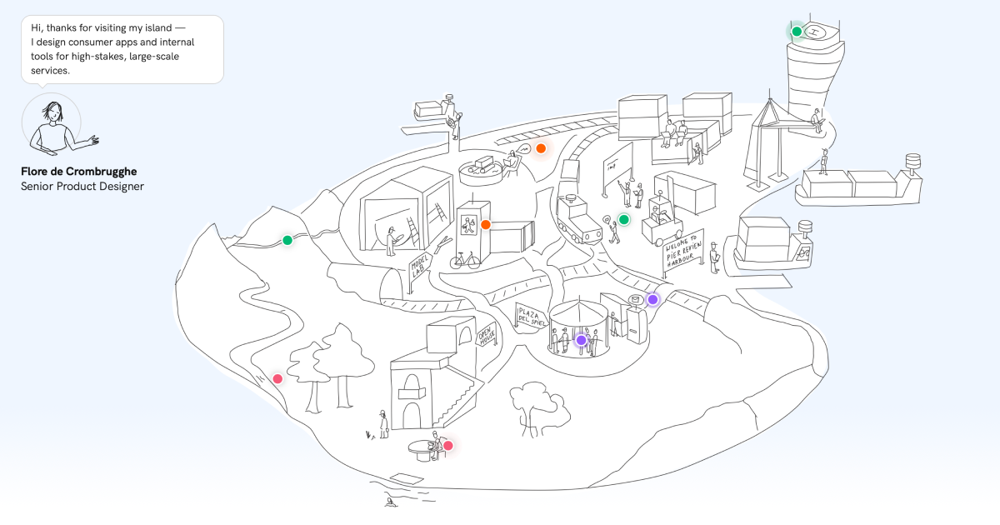

# Flore de Crombrugghe — portfolio

**[floredecrombrugghe.com](https://floredecrombrugghe.com)**



A personal portfolio whose homepage is an illustrated island rather than a list.
Nine markers sit on the drawing — five projects, a podcast episode, two personal
pieces and a "say hi" — and hovering or tapping one opens a popover that leads
into the work. The map is the navigation, not decoration above it.

Built with Claude Code over five weeks and 211 commits, designed in Figma in
parallel. The making of it is itself one of the case studies:
**[Welcome to my island](https://floredecrombrugghe.com/work/welcome-to-my-island)**.

---

## Stack

| | |
|---|---|
| **Framework** | Vite + React 18 + React Router |
| **Language** | Plain JS/JSX — no TypeScript |
| **Styling** | Tailwind, over CSS custom properties exported from Figma |
| **Content** | MDX per project, JS modules per case study, JSON hotspot manifest |
| **Type** | HK Grotesk, self-hosted (no CDN) |
| **Interaction** | `@floating-ui/react` for popovers, `react-zoom-pan-pinch` for the map on phones |
| **Hosting** | GitHub Pages, deployed by Actions on push to `main` |

## Running it

```bash
npm install
npm run dev
```

| Script | What it does |
|---|---|
| `npm run dev` | Dev server. Wraps Vite to restart it when `tailwind.config.js` changes — Tailwind 3 caches its ESM config for the life of the process, so an in-process restart silently keeps serving the old CSS. See [`scripts/dev.mjs`](scripts/dev.mjs). |
| `npm run build` | Production build, then the prerender pass (below). |
| `npm run preview:pages` | Builds and serves `dist` exactly as GitHub Pages does — including the 404 fallback and directory-index redirects. The only local setup that catches deploy-shaped bugs. |
| `npm run shoot` | Drives headless Chrome over CDP across six desktop viewports and writes a screenshot contact sheet plus measured metrics. Used for above-the-fold work. |

## Layout

```
src/
  components/        55 components; casestudy/ holds the subpage system
  content/
    projects/        one .mdx per project — frontmatter drives the card + the link preview
    case-studies/    one .js module per subpage — block structure and typed evidence slots
    sections/        section-level frontmatter (Work, Approach, About, Contact)
    hero-map-hotspots.json
  lib/               layout constants, content loading, shared hooks
  pages/             HomePage, ProjectPage, ProcessLogPage
  styles/tokens/     primitives -> semantic -> components, exported from Figma
scripts/             build, preview, measurement and image tooling
process-docs/        session-by-session design and build logs
```

**Adding a project** is one `.mdx` in `src/content/projects/` plus a 1200×630
image at `public/images/link-previews/<slug>.png`. The card, the route, the
`<title>` and the link preview all follow from that file — no registry to update.

---

## A few decisions worth reading

These are the ones that were not obvious up front, and where the reasoning
matters more than the code.

**Link previews are prerendered, because crawlers don't run JavaScript.**
Setting `og:` tags from inside React is invisible to LinkedIn, Slack and
WhatsApp — they fetch the URL, read the `<head>` that comes back, and stop. So
every shared case-study link unfurled with the homepage's image. After
`vite build`, [`scripts/prerender.mjs`](scripts/prerender.mjs) writes a real
`work/<slug>/index.html` per project, each with its own tags, read from the MDX
frontmatter rather than a list in the script.

**Deep links on a static host need a shim.** GitHub Pages only serves files
that exist, and `/work/:slug` lives in the router. [`public/404.html`](public/404.html)
re-encodes the path into a query string and an inline snippet in `index.html`
restores it with `history.replaceState` before React Router boots. Prerendering
has since given the project routes real files, so the shim now catches only
process logs and typos.

**Colour gets a semantic token layer; spacing deliberately doesn't.** A role
like `text-primary` can be re-pointed at a different grey, or a second theme —
the indirection earns its place. `24` is 24 under every theme, so an alias for
it would be a second name for the same number to keep in sync.

**The map is fitted to the artwork, not to the SVG's bounding box.** The export
carries empty margin, which was being laid out as if it were map. Measuring the
real artwork with `getBBox()` and hanging the empty bands outside the layout box
recovered 11–13% of map width across laptop screens.

**The hero must never fill the first screen.** A cold visitor needs evidence the
page continues. The reserve that guarantees it is *derived* from its four terms
in CSS rather than hand-tuned, so the gap and the reserve can't drift apart.

**Accessibility is structural.** Markers are real `<button>`s, popover links are
real `<a>`s, and hit areas meet the 44×44px minimum by growing invisible padding
rather than scaling the dot — so the target survives at any map size.

Full rationale, including the bugs that produced these, lives in
[`CLAUDE.md`](CLAUDE.md).

---

## Deploying

Push to `main`. [`.github/workflows/deploy.yml`](.github/workflows/deploy.yml)
builds and publishes via the Pages "GitHub Actions" source — no `gh-pages`
branch, no build output committed.

The site is served from a custom domain at the root, which means four things
have to agree: `base` in `vite.config.js`, the router's `basename` (which reads
it back), `pathSegmentsToKeep` in `public/404.html`, and `public/CNAME`. The
first three derive from one constant; `CNAME` does not, and deleting it silently
detaches the domain. The deployment section of [`CLAUDE.md`](CLAUDE.md) has the
detail.

## Docs

| File | What's in it |
|---|---|
| [`CLAUDE.md`](CLAUDE.md) | Architecture, content model, and the running decision log — including what was tried and rejected |
| [`PRD-Map-Layout-v1.md`](PRD-Map-Layout-v1.md) | The hotspot/popover interaction spec |
| [`process-docs/`](process-docs) | Per-session design and build logs |
| [`HANDOFF.md`](HANDOFF.md) | A point-in-time snapshot from 6 Aug 2026. Kept as a record; `CLAUDE.md` is the current source of truth |
